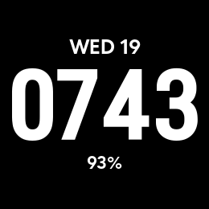

# Typeface 955

A deliberately simple watch face for the Garmin Forerunner 955. It puts the time first, with the date above it and the battery below it.

Time is fixed to **24-hour HHMM** with no colon. Battery position is fixed to the balanced location. Fresh installs default to **Smackers**.

## Time typefaces and selector order
1. Smackers
2. Nautica
3. Cleo
4. Pincoya
5. Alien

UP/DOWN moves between settings; START cycles the selected value while the actual face remains visible. Remaining settings: typeface, date size, battery size, percent symbol, and time/date/battery/background colors.

Date/time/battery centers remain vertically symmetric (57 / 130 / 203 px). Cleo retains its tested optical correction for internal glyph whitespace. Date and battery always use the normal secondary typeface, regardless of the selected time font.

## Color palette
Black, Red, Orange, Yellow, Green, Blue, Purple, Pink, White.

Build/install using `BUILD-AND-INSTALL-WINDOWS.md`.

## Battery and rendering work

This personal Forerunner 955 build keeps the complete-frame redraw required by
real hardware, but minimizes work between minute changes:

- Time is formatted only when the minute changes.
- Date and battery are queried/formatted only when the hour changes (plus first
  launch or an immediately relevant settings change).
- Weekday labels, center coordinates, justification, and optical time position
  are cached/constants rather than rebuilt every frame.
- Time font atlases are native hard-edge 1-bit black/white resources and are
  imported with antialiasing disabled.
- Font resources remain loaded outside the screen-update hot path.
- No seconds, timers, animations, or partial updates are used.
- `project.optimization = 3p` requests Garmin's highest documented numeric
  optimization plus performance optimizations. In VS Code leave the global
  Monkey C optimization setting at Default or its command-line flag can override
  the Jungle setting.

Date and battery fonts remain separate because the current design intentionally
uses different native pixel sizes for the date and battery at every named size.
A single bitmap-font resource cannot provide two native sizes for the same glyph
without scaling one of them, which would undo the sharpness work.

## Project layout

- `source/` contains the Monkey C application, renderer, and on-watch settings UI.
- `resources/` contains the bitmap fonts, settings, strings, and launcher icon.
- `preview/` contains a simulator capture of the default face.
- `BATTERY-OPTIMIZATION-NOTES.md` explains the rendering and caching decisions in more detail.
- `BUILD-AND-INSTALL-WINDOWS.md` covers simulator use and sideloading to a watch.

## Build and install

Install Garmin's Connect IQ SDK and Monkey C extension, open this repository in Visual Studio Code, and follow [`BUILD-AND-INSTALL-WINDOWS.md`](BUILD-AND-INSTALL-WINDOWS.md).

The project targets the Forerunner 955 and has been tested on physical hardware. I have not run a controlled battery comparison against a stock Garmin face, so the repository does not claim a measured battery-life improvement.
